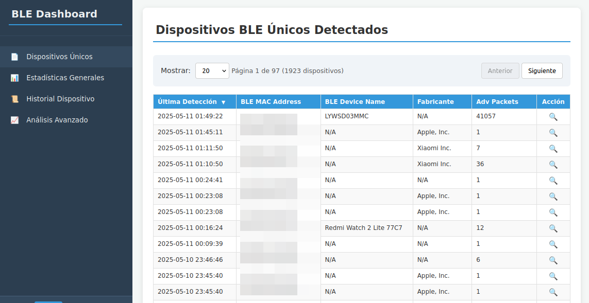
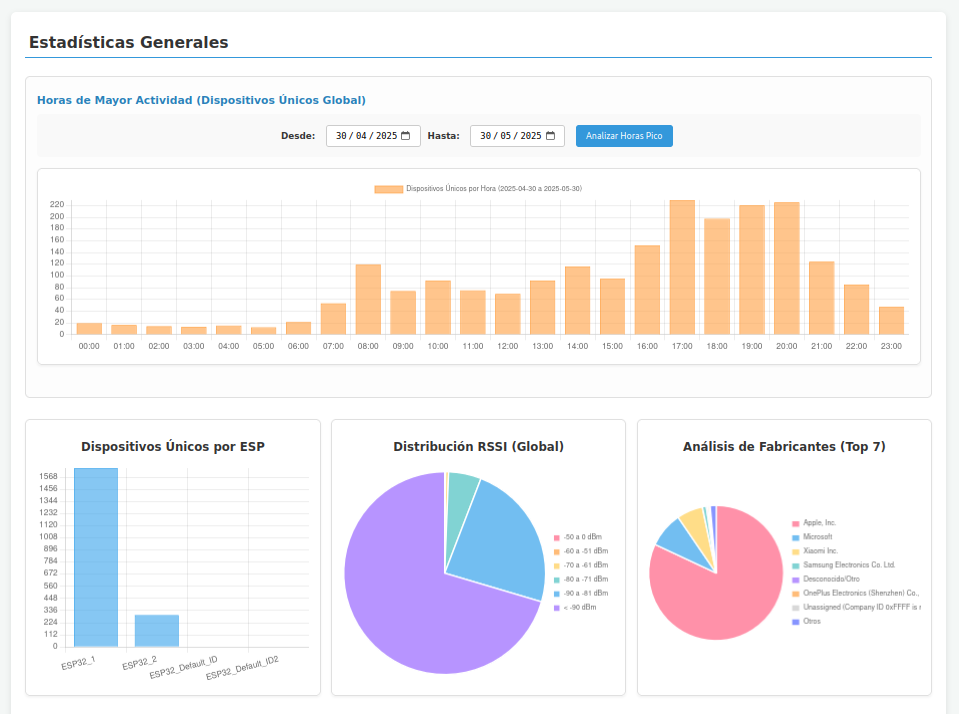
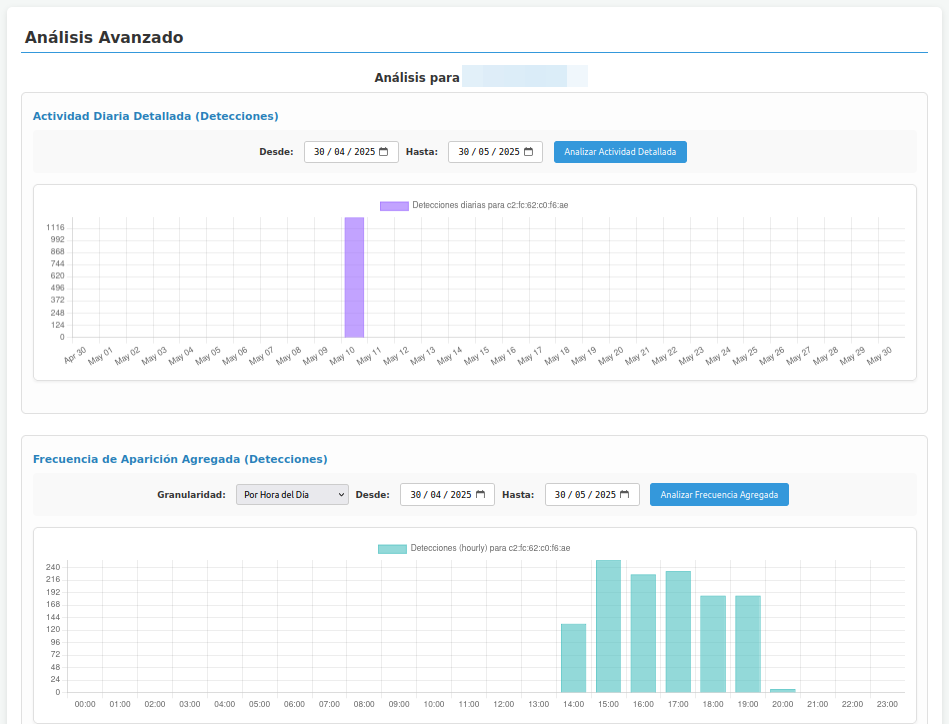
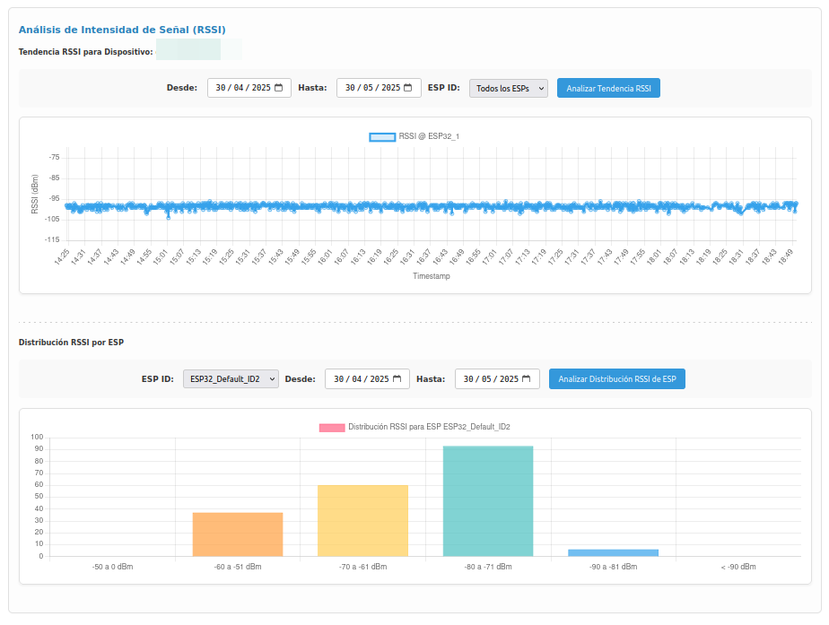

# 🔍 Proyecto de Escáner BLE con ESP32 y Dashboard Web 📊

Este proyecto implementa un sistema de escaneo de dispositivos Bluetooth Low Energy (BLE) utilizando múltiples ESP32-C3 como nodos de escaneo. Los datos recolectados se envían a un servidor backend (Flask/Python) que los almacena en una base de datos SQLite y los expone a través de una API RESTful. Una interfaz web (HTML/JavaScript con Chart.js) consume esta API para mostrar un dashboard interactivo con estadísticas, listado de dispositivos, historial y análisis avanzados.

## ✨ Características

*   **🌐 Escaneo Distribuido:** Múltiples ESP32-C3 pueden actuar como escáneres BLE.
*   **⚙️ Configuración Remota del ESP32:** A través de un portal cautivo (Modo AP) para WiFi, ID del dispositivo, servidor de datos y parámetros de escaneo BLE.
*   **🚀 Backend Robusto:** Servidor Flask para recibir, procesar y almacenar datos BLE.
*   **💾 Base de Datos SQLite:** Almacenamiento persistente de los datos escaneados.
*   **🔌 API RESTful:** Para la comunicación entre el backend y el frontend.
*   **📈 Dashboard Interactivo:**
    *   Visualización de dispositivos BLE únicos detectados (paginada y ordenable).
    *   Historial detallado por dispositivo (últimos 20 registros).
    *   Estadísticas generales:
        *   Dispositivos únicos por ESP.
        *   Distribución global de RSSI.
        *   Análisis de fabricantes de dispositivos (Top N).
        *   Horas de mayor actividad (dispositivos únicos globales).
    *   Análisis avanzado por dispositivo:
        *   Actividad diaria detallada (detecciones en un rango de fechas).
        *   Frecuencia de aparición agregada (por hora, día de la semana, semanal, mensual).
        *   Tendencia de la intensidad de señal (RSSI) a lo largo del tiempo (filtrable por ESP).
    *   Análisis avanzado por ESP:
        *   Distribución de RSSI para los dispositivos detectados por un ESP específico.
*   **🔄 Actualización Automática:** El dashboard puede refrescar automáticamente los datos.
*   **🏷️ Personalización de Fabricantes:** Nombres de fabricantes BLE pueden ser extendidos mediante un archivo `company_identifiers.yaml`.

## 🏗️ Arquitectura del Sistema

1.  **📱 Dispositivos ESP32-C3 (Nodos de Escaneo):**
    *   Escanean dispositivos BLE cercanos.
    *   Se conectan a la red WiFi configurada.
    *   Envían los datos BLE recolectados (en formato JSON) al servidor backend.
    *   Ofrecen un portal de configuración en Modo AP si no pueden conectarse a la WiFi o si se fuerza el reset de configuración.

2.  **🖥️ Servidor Backend (Flask/Python):**
    *   Recibe los datos de los ESP32 a través de un endpoint POST.
    *   Valida y almacena los datos en una base de datos SQLite (`ble_data.db`).
    *   Provee múltiples endpoints GET para que el frontend consulte los datos procesados y agregados.
    *   Utiliza `ble_utils.py` para parsear datos específicos de BLE (como `manufacturer_data`).

3.  **🌟 Interfaz Frontend (HTML/JavaScript):**
    *   Se sirve desde el endpoint `/dashboard` del servidor Flask.
    *   Realiza peticiones AJAX a los endpoints de la API del backend.
    *   Renderiza tablas y gráficos (usando Chart.js) para visualizar la información.
## Capturas de Pantalla

<div align="center">
  <table>
    <tr>
      <td align="center" valign="top">
        <p>Vista Principal - Dispositivos Únicos</p>
        
      </td>
      <td align="center" valign="top">
        <p>Estadísticas Generales</p>
        
      </td>
    </tr>
    <tr>
      <td align="center" valign="top">
        <p>Actividad diaria</p>
        
      </td>
      <td align="center" valign="top">
        <p>Análisis Avanzado - Tendencia RSSI</p>
        
      </td>
    </tr>
  </table>
</div>


## 🚀 Configuración y Despliegue

### 0. Clonar el Repositorio

Para obtener el código del proyecto, clona este repositorio desde GitHub:

```bash
git clone https://github.com/soyunomas/esp32-ble-scanner-dashboard.git
cd esp32-ble-scanner-dashboard
```

### 1. Backend (Servidor Flask) 🐍

#### Prerrequisitos

*   Python 3.7 o superior.
*   `pip` (gestor de paquetes de Python).
*   **SQLite3 y sus herramientas de desarrollo (en Ubuntu/Debian):**
    ```bash
    sudo apt update
    sudo apt install sqlite3 libsqlite3-dev
    ```

#### 💻 Instalación de Dependencias

Se recomienda crear y activar un entorno virtual:

```bash
python -m venv venv
# En macOS/Linux:
source venv/bin/activate
# En Windows:
# venv\Scripts\activate

```

Luego, instala las dependencias desde el archivo `requirements.txt`:

```bash
pip install -r requirements.txt
```

#### ▶️ Ejecución del Servidor

Desde el directorio raíz del proyecto (`ble-scanner-dashboard`):

```bash
python backend_server.py
```

El servidor backend se iniciará por defecto en `http://0.0.0.0:5000`. La base de datos (`ble_data.db` por defecto) y el archivo de log (`backend_server.log` por defecto) se crearán automáticamente en este directorio.

#### ⚙️ Configuración del Backend

Dentro de `backend_server.py`, puedes ajustar las siguientes constantes globales:

*   `DATABASE_NAME`: Nombre del archivo de la base de datos (e.g., `'ble_data.db'`).
*   `SERVER_HOST`: Host en el que escucha el servidor (e.g., `'0.0.0.0'` para todas las interfaces disponibles).
*   `SERVER_PORT`: Puerto del servidor (e.g., `5000`).
*   `API_ENDPOINT_PATH`: Ruta base para el endpoint de recepción de datos BLE desde los ESP32 (e.g., `'/api/ble-data'`).
*   `TARGET_TIMEZONE_PYTZ`: Zona horaria para la visualización de timestamps en el dashboard (e.g., `pytz.timezone('Atlantic/Canary')`).
*   `SQLITE_ANALYTICS_TIME_OFFSET`: Offset de tiempo para ciertas consultas analíticas en SQLite si es necesario (e.g., `'+1 hours'`).

#### 📋 `company_identifiers.yaml`

Este archivo permite añadir o sobrescribir los nombres de los fabricantes BLE basados en su Company ID. El formato es:

```yaml
company_identifiers:
  - value: 0x004C # ID en hexadecimal o decimal
    name: "Apple, Inc."
  - value: 76     # Otro ID (equivalente a 0x004C)
    name: "Apple, Inc. (Alias)"
  # ... más identificadores
```
El script `ble_utils.py` cargará estos identificadores al inicio.
Vale, aquí tienes una sección más concisa para el `README.md` sobre cómo cambiar la zona horaria:

## Ajuste de Zona Horaria

La aplicación muestra los timestamps convertidos a una zona horaria específica definida en el backend. Por defecto, está configurada para `Atlantic/Canary`.

Para cambiar la zona horaria de visualización:

1.  **Abrir `backend_server.py`**.
2.  **Modificar `TARGET_TIMEZONE_PYTZ`**:
    Busca la línea:
    ```python
    TARGET_TIMEZONE_PYTZ = pytz.timezone('Atlantic/Canary')
    ```
    Reemplaza `'Atlantic/Canary'` por el [nombre de zona horaria IANA](https://en.wikipedia.org/wiki/List_of_tz_database_time_zones) deseado (e.g., `'Europe/Madrid'`, `'America/New_York'`).

3.  **Ajustar `SQLITE_ANALYTICS_TIME_OFFSET`**:
    Esta variable (e.g., `'+1 hours'`) ayuda a SQLite a realizar agregaciones basadas en la hora local aproximada. Ajústala según el offset UTC típico de tu nueva zona horaria. Por ejemplo, para `Europe/Madrid` (UTC+1 o UTC+2 con DST), podrías usar `'+1 hours'` o `'+2 hours'` dependiendo de la mayor parte del año o la precisión requerida.
    ```python
    SQLITE_ANALYTICS_TIME_OFFSET = '+2 hours' # Ejemplo para Madrid (CEST)
    ```
    *Nota: La conversión exacta con manejo de DST se realiza en Python antes de mostrar timestamps individuales. Este offset es para agregaciones en la base de datos.*

4.  **Reiniciar el Servidor Backend**:
    Guarda los cambios en `backend_server.py` y reinicia el servidor Flask para aplicar la nueva configuración.
    ```bash
    python backend_server.py
    ```

### 2. ESP32-C3 (Nodo de Escaneo) 📡

El código para el ESP32-C3 se encuentra en `esp32_ble_scanner/esp32_ble_scanner.ino`.

#### Prerrequisitos

*   Arduino IDE (versión 1.8.13 o superior recomendada).
*   Placa ESP32-C3 (e.g., ESP32-C3-DevKitM-1, LILYGO T-OI PLUS ESP32-C3, etc.).
*   Cable USB para programación y alimentación.

#### 🔧 Configuración del Arduino IDE para ESP32-C3

1.  **Instalar el Soporte para Placas ESP32:**
    *   Abre Arduino IDE.
    *   Ve a `Archivo` > `Preferencias` (o `Arduino IDE` > `Settings...` en macOS).
    *   En el campo "Gestor de URLs Adicionales de Tarjetas", añade la siguiente URL:
        ```
        https://raw.githubusercontent.com/espressif/arduino-esp32/gh-pages/package_esp32_index.json
        ```
    *   Haz clic en "OK".
    *   Ve a `Herramientas` > `Placa` > `Gestor de Tarjetas...`.
    *   Busca "esp32" e instala el paquete "esp32 by Espressif Systems" (selecciona la última versión estable).

2.  **Instalar Librerías Necesarias:**
    *   Ve a `Herramientas` > `Gestionar Librerías...` (o `Programa` > `Incluir Librería` > `Administrar Bibliotecas...` / `Sketch` > `Include Library` > `Manage Libraries...`).
    *   Busca e instala las siguientes librerías:
        *   `ArduinoJson` by Benoit Blanchon (asegúrate de tener la versión 6.x o superior).
        *   Las librerías `Preferences`, `HTTPClient`, `WiFi`, y las relacionadas con BLE (`BLEDevice`, `BLEUtils`, `BLEScan`, `BLEAdvertisedDevice`) están incluidas con el core ESP32 y no necesitan instalación separada si tienes el paquete de placas ESP32 correctamente instalado.

#### 📥 Cargar el Firmware en el ESP32-C3

1.  **Abrir el Sketch:**
    *   Abre el archivo `esp32_ble_scanner/esp32_ble_scanner.ino` en el Arduino IDE.

2.  **Seleccionar la Placa y Configuración:**
    *   Ve a `Herramientas` > `Placa`. Dentro del submenú de "ESP32 Arduino", selecciona tu modelo específico de ESP32-C3 (e.g., "ESP32C3 Dev Module").
    *   **Esquema de Partición (Partition Scheme):** Ve a `Herramientas` > `Partition Scheme`. Selecciona una opción que ofrezca suficiente espacio para la aplicación. **Para este proyecto, se recomienda "HUGE APP (3MB No OTA/1MB SPIFFS)" o una similar con al menos 3MB para la aplicación.** Esto es crucial.
    *   **Puerto:** Conecta tu ESP32-C3 al ordenador. Ve a `Herramientas` > `Puerto` y selecciona el puerto COM (Windows) o `/dev/ttyUSBx` / `/dev/tty.usbserial-xxxx` (Linux/macOS) correcto.

3.  **Compilar y Cargar:**
    *   Haz clic en el botón "Verificar" (tick) para compilar el sketch y asegurar que no hay errores.
    *   Haz clic en el botón "Subir" (flecha hacia la derecha) en el Arduino IDE para compilar y cargar el firmware en el ESP32-C3.
    *   **Modo de Carga:** Algunas placas ESP32-C3 entran en modo de carga automáticamente. Otras pueden requerir que mantengas presionado el botón "BOOT" (generalmente conectado a GPIO9) mientras presionas y sueltas el botón "RESET" (o "EN"). Luego, suelta el botón "BOOT" una vez que la carga comience. Consulta la documentación de tu placa específica.

#### 🛠️ Configuración Inicial del ESP32 (Portal Cautivo)

Una vez cargado el firmware, el ESP32 intentará conectarse a la WiFi previamente configurada (si existe en su memoria `Preferences`). Si no hay configuración WiFi o no puede conectarse:

1.  **Modo AP:** El ESP32 iniciará un Punto de Acceso WiFi con el SSID **`ESP32-Device-Config`**.
2.  **Conexión al AP:** Conecta tu ordenador, tablet o móvil a esta red WiFi. No requiere contraseña.
3.  **Portal de Configuración:** Una vez conectado, abre un navegador web y ve a la dirección `http://192.168.4.1` (esta es la IP por defecto del ESP32 en modo AP).
4.  **Configurar los Parámetros:**
    *   **Identificador del Dispositivo:** Asigna un nombre único para este ESP32 (e.g., `ESP_Scanner_Oficina`, `ESP_Sensor_01`). Máximo 32 caracteres.
    *   **Configuración WiFi:**
        *   Puedes hacer clic en "Escanear Redes WiFi" para ver las redes disponibles y seleccionar una para autocompletar el SSID.
        *   Introduce el **SSID** (nombre de tu red WiFi) y la **Contraseña WiFi**.
    *   **Configuración Servidor de Datos:**
        *   **IP del Servidor:** La dirección IP de la máquina donde está corriendo el `backend_server.py`.
        *   **Puerto del Servidor:** El puerto configurado en el backend (por defecto `5000`).
    *   **Configuración Escaneo BLE:**
        *   **Intervalo entre ciclos de escaneo/envío (segundos):** Tiempo total desde el inicio de un ciclo de escaneo hasta el inicio del siguiente. Incluye el tiempo de escaneo y el tiempo de envío.
        *   **Duración de cada escaneo BLE (segundos):** Cuánto tiempo el ESP32 escaneará activamente dispositivos BLE en cada ciclo.
5.  **Guardar y Reiniciar:** Cada sección ("Identificador", "WiFi", "Servidor", "BLE") tiene su propio botón de guardar. Al hacer clic en "Guardar ... y Reiniciar", el ESP32 almacenará la configuración correspondiente y se reiniciará para aplicar los cambios.

#### 🔄 Reset de Configuración del ESP32

Para borrar toda la configuración almacenada en el ESP32 (WiFi, servidor, ID, etc.) y forzarlo a volver al Modo AP para una nueva configuración:

1.  El pin `RESET_CONFIG_BUTTON_PIN` está definido en el código como `GPIO_NUM_9`. Este pin corresponde frecuentemente al botón etiquetado como "BOOT" o "FLASH" en muchas placas ESP32-C3.
2.  Asegúrate de que el ESP32 esté alimentado.
3.  Mantén presionado el botón conectado a `GPIO9`.
4.  Mientras mantienes presionado `GPIO9`, reinicia el ESP32. Puedes hacerlo:
    *   Desconectando y reconectando la alimentación USB.
    *   O, si tu placa tiene un botón "RESET" (o "EN"), presionándolo y soltándolo mientras mantienes `GPIO9` presionado.
5.  Sigue manteniendo presionado `GPIO9` durante el arranque del ESP32 por al menos el tiempo configurado en `RESET_CONFIG_HOLD_TIME_MS` (por defecto 5000 milisegundos, es decir, 5 segundos).
6.  Si tienes el Monitor Serie del Arduino IDE abierto (a 115200 baudios), verás mensajes indicando el proceso de cuenta atrás y borrado.
7.  Una vez borrada la configuración, el ESP32 se reiniciará automáticamente y entrará en Modo AP, permitiendo una nueva configuración a través del portal web.

### 3. Uso del Dashboard Web 💻

1.  Asegúrate de que el servidor backend (`backend_server.py`) esté corriendo.
2.  En un navegador web, accede a la dirección del servidor backend seguida de `/dashboard`.
    *   Si el backend corre en tu máquina local: `http://localhost:5000/dashboard`
    *   Si el backend corre en otra máquina en tu red: `http://<IP_DEL_SERVIDOR_BACKEND>:5000/dashboard`
3.  Explora las diferentes secciones del dashboard:
    *   **🔍 Dispositivos Únicos:** Muestra una tabla paginada y ordenable de todos los dispositivos BLE detectados de forma única. Al hacer clic en una fila:
        *   Se carga el historial de ese dispositivo.
        *   Se habilitan las opciones de "Análisis Avanzado" para esa MAC.
        *   Se pre-rellenan las fechas (mes actual) para los análisis de actividad y se dispara el análisis de "Actividad Diaria Detallada".
    *   **📊 Estadísticas Generales:** Presenta gráficos globales sobre los datos recolectados.
    *   **📜 Historial Dispositivo:** (Se activa al seleccionar una MAC) Muestra los últimos 20 registros de un dispositivo específico.
    *   **📈 Análisis Avanzado:** (Se activa al seleccionar una MAC) Permite análisis más profundos sobre un dispositivo específico, incluyendo tendencias de actividad y RSSI.

## 👥 Contribuciones

Las contribuciones son bienvenidas. Por favor, abre un *issue* para discutir cambios mayores, proponer nuevas funcionalidades o reportar bugs. Si deseas contribuir con código, considera hacer un *fork* del repositorio y enviar un *pull request*.

## 📄 Licencia

Este proyecto está licenciado bajo la Licencia MIT. Ver el archivo `LICENSE` para más detalles.
